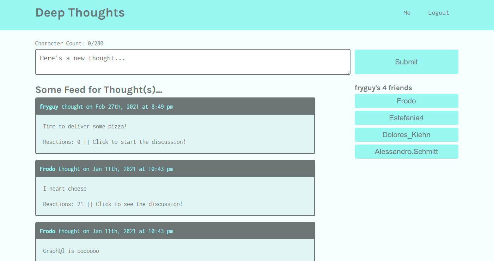

# Deep Thoughts
A social-media app built with GraphQL and Apollo server.

## Table of Contents
  - [Description](#description)
  - [Technology Used](#technology-used)
  - [Screenshots](#screenshots)
      - [Homepage:](#homepage)
      - [User Profile:](#user-profile)
      - [Single Thought:](#single-thought)
  - [Links](#links)
  - [Licenses](#licenses)
  - [Developer(s)](#developers)

## Description
Deep Thoughts is a social media app where users can create thoughts, add reactions to other users' thoughts, and add other users to their friend list. Users can also view their own profile with their thoughts listed out, or view other users' profiles with all of their thoughts listed.

This is a full-stack MERN app using a GraphQL API and Apollo Server for interaction with the database. React was used on the front-end and MongoDB, Mongoose, Express and Node.js on the backend. GraphQL queries and mutations were used to request data and post data.

## Technology Used
  
  
  
  
    
   
  
  
   
  
  

## Screenshots

#### Homepage:

#### User Profile:

 #### Single Thought:
 

## Links
- **[Deployed App](https://desolate-chamber-09466.herokuapp.com/)**
- **[GitHub Repo](https://github.com/ramantv/deep-thoughts)**

## Licenses

## Developer(s)
* [Raman TV.](https://github.com/ramantv)
